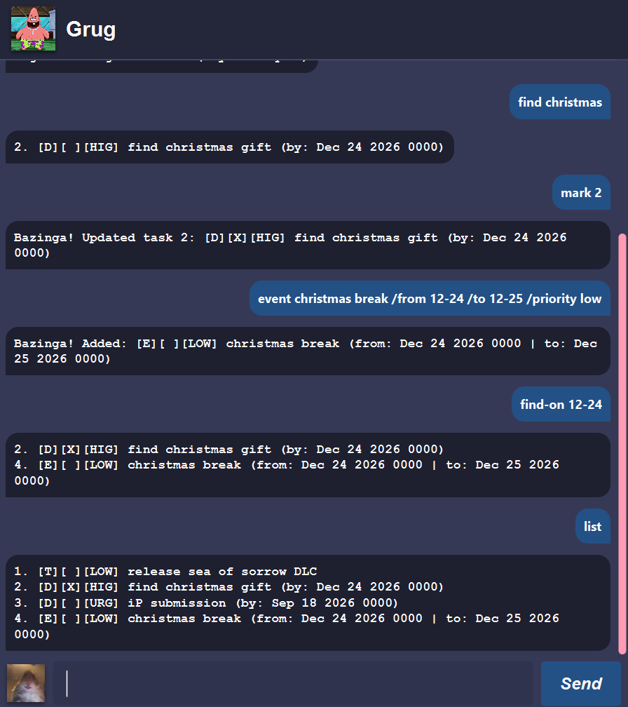

# Grug User Guide


Grug is a text-based caveman chatbot for people to manage their tasks. You can add different kinds of tasks, and ask Grug to find and edit them for you!

## Table of Contents
- [Grug User Guide](#grug-user-guide)
  - [Table of Contents](#table-of-contents)
  - [Quickstart](#quickstart)
  - [The Command Format](#the-command-format)
    - [Arguments](#arguments)
    - [Date-Times](#date-times)
    - [Case Sensitivity](#case-sensitivity)
    - [Escaping Leading Slashes](#escaping-leading-slashes)
    - [Priorities](#priorities)
    - [Tasks](#tasks)
  - [Features](#features)
    - [Adding todos](#adding-todos)
    - [Adding deadlines](#adding-deadlines)
    - [Adding events](#adding-events)
    - [Listing all tasks](#listing-all-tasks)
    - [Marking tasks](#marking-tasks)
    - [Unmarking tasks](#unmarking-tasks)
    - [Deleting tasks](#deleting-tasks)
    - [Updating a task's priority](#updating-a-tasks-priority)
    - [Finding tasks by details](#finding-tasks-by-details)
    - [Finding tasks by date](#finding-tasks-by-date)
    - [Quitting](#quitting)
    - [Saving and Loading](#saving-and-loading)

## Quickstart
1. Ensure you have [Java 25](https://www.oracle.com/asean/java/technologies/downloads/#java25) installed
2. Download `grug.jar` from the [latest release](https://github.com/Yik-Wee/ip/releases/latest)
3. Either double-click `grug.jar` in your file manager, or run `java -jar grug.jar`
4. A window will pop up and you can start entering commands! See [features](#features) for a full list of commands

## The Command Format
Learn how the inputs and outputs of commands are formatted.

*Skip to [features](#features) to see the full list of commands*.

### Arguments
Text in `UPPER_CASE` are the arguments you provide.

Example:
- You should replace `DETAILS` in `todo DETAILS` with your own details, such as `go for a run`.

### Date-Times
Date-time ***inputs*** use the `[yyyy-]MM-dd[ HH[:]mm]` format. We'll refer to these as `DateTime`s.
- The month and day must be supplied.
  - e.g. `Dec 25` becomes `12-25`.
- Optionally, you can also supply the year. *This is the current year by default*.
  - e.g. `2026 Dec 25` becomes `2026-12-25`.
- Optionally, you can also supply the **24 hour** time. *This is midnight `00:00` by default*.
  - e.g. `Dec 25 11:59 PM` becomes either `12-25 23:59` or `12-25 2359` (with at least 1 space between the date and time).

Date-time ***outputs*** use the `MMM dd yyyy HHmm` format.
- e.g. The input `2026-12-25 23:59` is displayed as `Dec 25 2026 2359`.

### Case Sensitivity
Commands, flags, and priorities are case-insensitive.

Example:
- Both `todo essay /priority low` and `TODO essay /PRIORITY LOW` will work.

### Escaping Leading Slashes
You can escape leading slashes with `//`.

Example:
- `todo a // b` will add a todo task with the details `a / b`, but `todo a//b` will add `a//b`.

### Priorities
You can mark a task with 5 different priorities:

| Priority Level       | Value |
| -------------------- | ----- |
| URGENT               | `URG` |
| HIGH                 | `HIG` |
| MEDIUM (**default**) | `MED` |
| LOW                  | `LOW` |
| OPTIONAL             | `OPT` |

*NOTE: The `Value` column represents the value to pass to the priority flag, e.g. `/priority LOW`.*

### Tasks
Tasks are displayed in the format `[Task Type][Completion][Priority Value] DETAILS`.

Task Type:

| Task Type | Display |
| --------- | ------- |
| todo      | `T`     |
| deadline  | `D`     |
| event     | `E`     |

Completion:

| Completion | Display             |
| ---------- | ------------------- |
| true       | `X`                 |
| false      | ` ` (a blank space) |

See [Priorities](#priorities) for priority values.

Example: `[T][ ][MED] go for a run` represents an *incomplete* *todo* task with *medium* priority.

## Features

### Adding todos
Adds a todo task to the task list.

Format: `todo DETAILS`

*Note: Extra whitespaces are removed from `DETAILS`*

Example: `todo go for a run`

Output:
```
Bazinga! Added: [T][ ][MED] go for a run
```

### Adding deadlines
Adds a deadline task to the task list.

Format: `deadline DETAILS /by DEADLINE`, where `DEADLINE` is a [DateTime](#date-times)

*Note: Extra whitespaces are removed from `DETAILS`*

Example: `deadline finish essay /by 2026-09-18 2359`

Output:
```
Bazinga! Added: [D][ ][MED] finish essay (by: Sep 18 2026 2359)
```

### Adding events
Adds an event task to the task list

Format: `event DETAILS /from START /to END`, where `START` and `END` are [DateTime](#date-times)s

*Note: Extra whitespaces are removed from `DETAILS`*

Example:
`event christmas break /from 2026-12-24 0000 /to 2026-12-25 2359`

Output:
```
Bazinga! Added: [E][ ][MED] christmas break (from: Dec 24 2026 0000 | to: Dec 25 2026 2359)
```

### Listing all tasks
Lists all tasks.

Format: `list`

Example: `list`

Output:
```
1. [T][ ][MED] go for a run
2. [D][ ][MED] finish essay (by: Sep 18 2026 2359)
3. [E][ ][MED] christmas break (from: Dec 24 2026 0000 | to: Dec 25 2026 2359)
```

### Marking tasks
Marks a task as complete.

Format: `mark TASKNUM`, where `TASKNUM` is the task's number starting from `1`

*Note: If `TASKNUM` is out of range, you'll see a helpful error message instead*

Example: `mark 1`

Output:
```
Bazinga! Updated task 1: [T][X][MED] go for a run"
```

### Unmarking tasks
Unmarks a task, setting it as incomplete.

Format: `unmark TASKNUM`, where `TASKNUM` is the task's number starting from `1`

*Note: If `TASKNUM` is out of range, you'll see a helpful error message instead*

Example: `unmark 1`

Output:
```
Bazinga! Updated task 1: [T][X][MED] go for a run"
```

### Deleting tasks
Deletes a task from the task list.

Format: `delete TASKNUM`, where `TASKNUM` is the task's number starting from `1`

*Note: If `TASKNUM` is out of range, you'll see a helpful error message instead*

***WARNING: This will permanently delete the task. Make sure you have the correct task number before deleting***

Example: `delete 1`

Output:
```
Bazinga! Deleted: [T][X][MED] go for a run"
```

### Updating a task's priority
Updates a task's priority.

Format: `set-priority TASKNUM /priority VALUE`, where `TASKNUM` is the task's number starting from `1`, and `VALUE` is a [Priority Value](#priorities)

*Note: If `TASKNUM` is out of range, or `VALUE` is invalid, you'll see a helpful error message instead*

Example: `set-priority 1 /priority URG`

Output:
```
Bazinga! Updated task 1: [D][ ][URG] finish essay (by: Sep 18 2026 2359)
```

### Finding tasks by details
Finds tasks whose details **contain** the search query.

Format: `find DETAILS`

*Note: Extra whitespaces are removed from `DETAILS`*

Example: `find christmas`

Output:
```
1. [T][ ][MED] go christmas shopping
3. [E][ ][MED] christmas break (from: Dec 24 2026 0000 | to: Dec 25 2026 2359)
```

### Finding tasks by date
Finds deadlines and events that occur on the given date.

Format: `find-on DATE`, where `DATE` is a [DateTime](#date-times) ***whose time is ignored***

*Note: The `DATE`'s time, if provided, is **ignored***

Example: `find-on 12-24`

Output:
```
3. [E][ ][MED] christmas break (from: Dec 24 2026 0000 | to: Dec 25 2026 2359)
```

### Quitting
Quits the app.

Format: `bye`

Example: `bye`

Output:
```
Unga. Bye. さよなら
```
Then, the application is closed.

### Saving and Loading
Tasks are automatically saved to `tasks.txt` by the app whenever the task list is modified, and loaded on startup.

***WARNING:***

If your save file is corrupted, Grug will show a helpful error message showing which part of the file was corrupted.

Then, Grug will attempt to backup your save file to `tasks.bak.txt` and overwrite `tasks.txt`.

If the backup fails, your existing save file ***may be overwritten if you run commands that update the task list***. But don't panic! You can simply quit the application, move your save file somewhere safe and attempt to fix the file.
